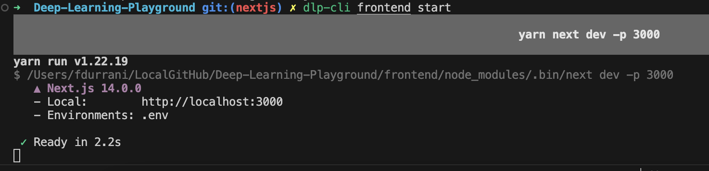
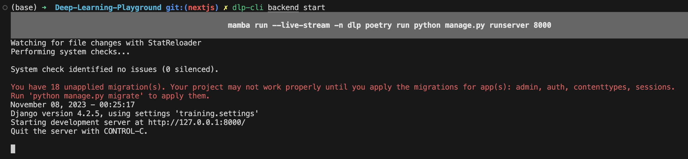

# Deep Learning Playground

Web Application where people new to Machine Learning can input a dataset and experiment around with basic Pytorch modules through a drag and drop interface

> **Deployed website:** https://datasciencegt-dlp.com </br> **GitHub repo:** https://github.com/DSGT-DLP/Deep-Learning-Playground

# Getting Started

### Prerequisites

Have the following installed first:
1. **If you are on Mac or Linux, we strongly recommend installing Homebrew**. You can install Homebrew by running `/bin/bash -c "$(curl -fsSL https://raw.githubusercontent.com/Homebrew/install/HEAD/install.sh)"`. See [this link](https://brew.sh/) for more information
1. [Node.js v20 via NVM](https://github.com/nvm-sh/nvm#installing-and-updating) (Install nvm first, and then install node & npm using nvm).
   1. For Mac or Linux, run the commands shown [here](https://github.com/nvm-sh/nvm?tab=readme-ov-file#install--update-script)
   1. For Windows, follow the instructions from the "How to Install NVM on Windows" section of this [article](https://www.freecodecamp.org/news/node-version-manager-nvm-install-guide/)
   1. To get Node v20 with NVM, run `nvm install 20` followed by `nvm use 20`. Run `node -v` to confirm that the node version is at least v20
1. [Mamba](https://github.com/conda-forge/miniforge#miniforge) (Make sure to install using the Miniforge distribution. On windows, remember to check the box that says that it will add mamba to PATH)
   1. See this [section](https://github.com/conda-forge/miniforge?tab=readme-ov-file#download) of the README to pick the right installer for Miniforge based on your Operating System. Note that for Mac, **you will need to make the Miniforge installer script executable** through running a command like `chmod +x Miniforge3-MacOSX-arm64.sh` (if you are on M1 or later) or `chmod +x Miniforge3-MacOSX-x86_64` otherwise
   1. For Windows, Miniforge recommends running mamba related commands through "Miniforge Prompt". You can access it in your app catalog in your laptop. An error you may run into is described [here](https://github.com/conda-forge/miniforge/issues/549) and running in Miniforge Prompt should help unblock for now
   1. If you are not able to run mamba commands right after installing Miniforge on Mac or Linux, you can try closing and reopening the terminal so that updates to the environment variables persist
1. [pip](https://pip.pypa.io/en/stable/installation/) (Is also automatically installed with Python via Python's installer, make sure this version of pip is installed globally)
1. [dlp-cli](https://github.com/DSGT-DLP/dlp-cli#readme) (We have our own cli!)
1. [AWS CLI](https://docs.aws.amazon.com/cli/latest/userguide/getting-started-install.html#getting-started-install-instructions)
1. [VSCode](https://code.visualstudio.com/)
1. [git](https://git-scm.com/downloads)

### Recommended

1. [GitHub Student Developer Pack](https://education.github.com/pack) - Get GitHub Pro features and GitHub Copilot access for free
1. [GitKraken](https://help.gitkraken.com/gitkraken-client/how-to-install/) - for helping with Git commands, especially if you're new to Git
1. [Postman](https://www.postman.com/downloads/) - Extremely helpful for testing REST APIs
1. [Chrome](https://www.google.com/chrome/) - For Chrome developer tools
1. [Redux Devtools](https://chrome.google.com/webstore/detail/redux-devtools/lmhkpmbekcpmknklioeibfkpmmfibljd) - Helpful for debugging any Redux
1. [Docker](https://docs.docker.com/engine/install/) - For Docker images
1. [go](https://go.dev/doc/install) - In case if you ever need to contribute to the dlp-cli
1. VSCode Extensions:
   1. [Github Copilot](https://marketplace.visualstudio.com/items?itemName=GitHub.copilot)
   1. [IntelliCode](https://marketplace.visualstudio.com/items?itemName=VisualStudioExptTeam.vscodeintellicode)
   1. [Python](https://marketplace.visualstudio.com/items?itemName=ms-python.python)
   1. [Black Formatter](https://marketplace.visualstudio.com/items?itemName=ms-python.black-formatter)
   1. [Pretter - Code formatter](https://marketplace.visualstudio.com/items?itemName=esbenp.prettier-vscode)
   1. [ESLint](https://marketplace.visualstudio.com/items?itemName=dbaeumer.vscode-eslint)
   1. [Docker](https://marketplace.visualstudio.com/items?itemName=ms-azuretools.vscode-docker)
   1. [Go](https://marketplace.visualstudio.com/items?itemName=golang.Go)

## 1. Request invites :mailbox:
Please message a Project Lead(@Project Lead) in the DLP Discord Server. Request the following access:
* Git Guardian Access
* AWS Access
* Write access to the `Deep-Learning-Playground` and `dlp-cli` repos
* Access to collaborate on the Notion page to add any documentation

Project Leads should be following up on granting the access within 24-48 hours. 

## 2. Clone the Repository

If you want the **main** project, run in the directory of your choice:
```sh
git clone https://github.com/DSGT-DLP/Deep-Learning-Playground.git
```

If this installation is for the **beginner project**, instead do:
```sh
git clone https://github.com/DSGT-DLP/dlp-practice.git
```


## 3. Frontend and Backend Package Installation

Run the following commands in the project directory (the root folder created after cloning):

| Action                           | Command                    |
| -------------------------------- | -------------------------- |
| Install/Update Frontend Packages | `dlp-cli frontend install` |
| Install/Update Backend Packages  | `dlp-cli backend install`  |

## 4. To start on localhost

Run the following commands in the project directory (the root folder created after cloning):

| Action               | Command                  |
| -------------------- | ------------------------ |
| Running the Frontend | `dlp-cli frontend start` |
| Running the Backend  | `dlp-cli backend start`  |

Make sure to run the above two commands in separate terminals. You should see these Terminal messages and be able to go to these URLs on success:




## 5. GitGuardian Pre-commit Check

To install the GitGuardian cli and pre-commit, run

```sh
pip install ggshield
pip install pre-commit
```

To protect our secrets, we use the GitGuardian ggshield pre-commit check to ensure no keys are being committed. After installing the backend, run

```sh
pre-commit install
```

You should get output like `pre-commit installed at .git/hooks/pre-commit`. Login to GitGuardian to activate the pre-commit hook using

```sh
ggshield auth login
```

If this command works properly, you will be redirected to an auth route in the Git Guardian website. **Sign in using your Github account**. Then, you should be all set!

### Additional VSCode Setup (Recommended)

Access the VSCode command palette via `Ctrl+Shift+P`. Press `Python: Select Interpreter`. You need the Python VSCode extension for this.

Select the Python Interpreter named `dlp`.

## 6. AWS Setup
If you will be working on tasks that interface with AWS resources/services, please follow the below steps (please install AWS CLI using this [link](https://docs.aws.amazon.com/cli/latest/userguide/getting-started-install.html) first):

1. Request an AWS Account for Deep Learning Playground by messaging a Project Lead (@Project Lead) in the DLP Discord. Please include your Github username. a personal email account, and full name
1. Once an AWS Account has been created, you will receive an email from AWS that will require you to setup a password
1. When you login, you should be seeing that the account you're added under is `Data Science Initiative Inc`
1. Click on the dropdown to expand the `Data Science Initiative Inc` entry and select the `Command Line or programmatic access button`
1. Open your terminal and navigate to the DLP directory
   1. Run `aws configure sso``. Follow the prompts to enter the SSO Start URL (this comes from step 2) and the below values
   ```
   sso_region = us-east-1
   sso_session = dlp
   sso_registration_scopes = sso:account:access
   default output format = None
   cli profile name = just press enter (use the default one provided)
   ````
   1. Make sure you follow the instructions in the terminal to ensure your credentials are set correctly (eg: allow botocore to access data should be selected as "yes")
   1. Run `cat ~/.aws/config` to look for the sso profile configured.
   1. **IMPORTANT:** Run `export AWS_PROFILE=<sso_profile_name from the previous step>`, for Linux and Mac, or `setx AWS_PROFILE <sso_profile_name from the previous step>` for Windows. Note that when you close and reopen your terminal, you will **need to rerun this export command**

Please message in the DLP Discord or view the [Bug Manual page](https://github.com/DSGT-DLP/Deep-Learning-Playground/wiki/Bug-Manual) and [Documentation](https://www.notion.so/General-011ddb00fda146048ec1beb2d18c8abc) if you have any difficulty/issue with these steps. 

# Architecture

See [Architecture.md](./.github/Architecture.md)

# License

Deep Learning Playground is MIT licensed, as found in the [LICENSE](./LICENSE) file.

Deep Learning Playground documentation is Creative Commons licensed, as found in the [LICENSE-docs](./.github/LICENSE-docs) file.
